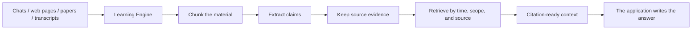
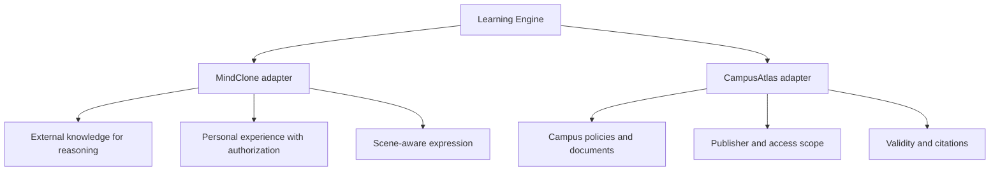

# EvolvingAgents

中文版本：[README.zh-CN.md](README.zh-CN.md)

This repository is home to a few agents that are still learning how to grow up.

They have different personalities and different jobs, but they share one learning workshop: read a source, keep its evidence, and retrieve the useful parts when a real question arrives. We call that workshop **Learning Engine**.

Learning Engine is not trying to pretend it knows everything. It is more like a slightly fussy librarian: every piece of knowledge should have a source, a time window, and a reason it is allowed in the current context.

## How The Engine Works



The core rule is simple: **a claim can be understood before it becomes a person's experience, opinion, or decision.**



## Learning Engine: The Shared Foundation

Learning Engine turns a pile of material that “might be useful someday” into knowledge that can be searched, traced, challenged, and cited.

It handles:

- checksum deduplication, so the same article does not get “learned” three times;
- semantic chunking with offsets back to the original source;
- structured claim extraction with supporting evidence;
- source updates, stale derivations, validity windows, and provenance;
- lightweight retrieval today, with vector retrievers and rerankers available later;
- compact contexts with `E1`, `E2`, and other source citations;
- rejection of cookies, passwords, tokens, and API keys in learning metadata.

It is deliberately not a chatbot, crawler, document parser, or universal context blender. Its job is narrower and more useful: make learning traceable, bounded, and reusable.

## First Resident: MindClone

MindClone is a long-term personal agent. It is not a chatbot that pours your entire chat history into a black box and announces, “I understand you now.”

It listens, remembers where things came from, learns external material without stealing its authors' biographies, and only turns a learned idea into a personal view after discussion, agreement, or real use. It can make an answer clearer and more professional, but it cannot quietly turn someone else's experience into yours.

MindClone uses Learning Engine for the neutral question: **what is this claim, where did it come from, and what supports it?** Its own cognition adapter handles the personal question: **may I say this as myself, in this scene?**

Interviewing is the first acceptance scenario, not the final product boundary. A submitted resume can take precedence inside one interview without rewriting the long-term identity after the interview ends.

## Second Resident: CampusAtlas

CampusAtlas deals with a different kind of mess: many campus websites, frequently changing policies, pages that require login, and rules that were valid last year but are not valid today.

It reuses the same Learning Engine with a campus policy adapter that tracks who published a rule, who it applies to, when it is valid, and whether the current user may retrieve it. Scholarship policies, graduate recommendations, administrative procedures, and internal documents can all travel through the same evidence chain.

Learning Engine does not need to know what a scholarship is. It provides sources, evidence, claims, time, and retrieval; CampusAtlas translates those capabilities into campus rules.

## Repository Map

```text
apps/mind-clone/       MindClone, its paper, and its research corpus
apps/campus-atlas/     CampusAtlas policy adapter
packages/learning-engine/
                       shared source-to-evidence foundation
docs/                  cross-application architecture and contribution rules
```

There will be more agents later. They should reuse the foundation before building another one from scratch.

## Further Reading

- [Learning Engine](packages/learning-engine/README.md)
- [MindClone](apps/mind-clone/README.md)
- [CampusAtlas](apps/campus-atlas/README.md)
- [Monorepo boundaries](docs/monorepo.md)
- [Commit conventions](docs/commit-conventions.md)
