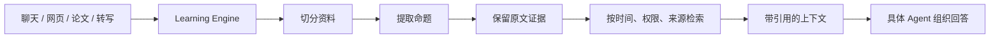

# EvolvingAgents

这里住着几位还在成长中的 Agent。它们性格不同、工作不同，但共用一套学习地基：把资料读懂，留下原文证据，在真正需要时把相关知识找回来。这套地基叫 **Learning Engine**。

它像一个有点较真的图书管理员：每条知识都要有来源、有效时间和使用边界。



核心原则很简单：**知识可以先被理解，但不能因为被理解，就自动变成某个人的经历、观点或决定。**

## 两位住客

### MindClone

MindClone 是长期学习的个人 Agent。它把外部知识、个人经历、表达方式和当前场景分开管理。面试是第一场验收：本次投递的简历可以在当前面试中优先，但不会改写长期身份。

### CampusAtlas

CampusAtlas 面对学校政策、登录页面、校内文件和不断变化的有效期。它复用同一个 Learning Engine，再由校园适配器处理发布部门、适用人群、权限和政策时效。

## 目录

```text
apps/mind-clone/       MindClone、论文和研究资料
apps/campus-atlas/     CampusAtlas 校园政策适配器
packages/learning-engine/
                       共用的来源、证据和检索地基
docs/                  跨项目架构与协作规则
```

阅读入口：

- [Learning Engine](packages/learning-engine/README.md)
- [MindClone](apps/mind-clone/README.md)
- [CampusAtlas](apps/campus-atlas/README.md)
