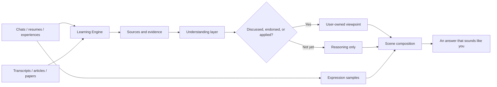
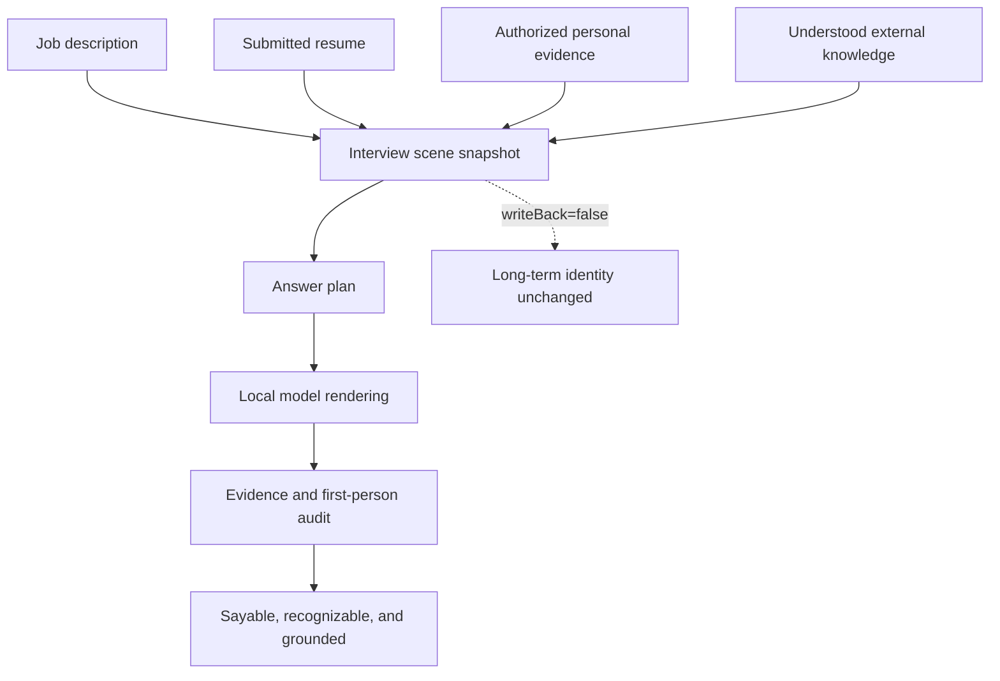

# MindClone

中文版本：[README.zh-CN.md](README.zh-CN.md)

MindClone is not a chatbot that throws your entire chat history into a black box and declares, “I understand you now.”

It is meant to feel more like a long-term companion: it listens, remembers where things came from, learns external material without borrowing its authors' biographies, and gradually forms a clearer picture of your views through discussion and use. It may make an answer more professional, but it cannot quietly turn someone else's experience into yours.

## What It Learns



Its memory is not one giant soup. It has separate channels that can talk to each other without casually swapping identities:

- **External knowledge** can improve reasoning, but it does not become your opinion automatically.
- **Personal experience** requires evidence and authorization before it can be expressed in the first person.
- **Expression** captures how you tend to conclude, explain, disagree, and wrap things up.
- **Scene context** can change what matters for an interview or conversation without rewriting your long-term identity.

## Interviewing Is The First Test

Interviewing is the first high-pressure acceptance scenario because it asks several questions at once:

- Do you understand the field?
- Is that experience really yours?
- Can a different resume guide a different interview without corrupting the rest of your profile?
- Does the answer sound like you, rather than like an over-helpful AI?

For each interview, MindClone freezes the submitted job description, resume, audience, and goal into a temporary scene. The resume has precedence inside that scene, but the scene cannot write itself back into the long-term identity.



## The Learning Engine Boundary

MindClone and CampusAtlas share [Learning Engine](../../packages/learning-engine). It provides the neutral learning foundation:

- split long material into bounded chunks;
- extract reusable claims;
- retain source evidence and provenance;
- handle duplicates, stale derivations, and validity windows;
- retrieve relevant knowledge with citations.

MindClone owns the human-facing part: understanding versus endorsement, personal-experience authorization, viewpoint conflict, resume precedence, expression style, and scene composition. Learning Engine answers **what is this and where did it come from?** MindClone answers **may I say it as myself, and when?**

## Learning From Short Videos

The current short-video path learns **transcribed speech only**. It does not analyze video frames.

Paste a Douyin share message and MindClone uses TiKHub to resolve the media, downloads temporary files, extracts audio, and runs local Whisper. Temporary video and audio are removed afterward; only the transcript and provenance enter the learning flow.

For local transcription, install `ffmpeg`, `whisper-cpp`, and a Whisper model. Keep the model and API keys on the machine; they are not committed to Git.

## Running MindClone

From the repository root:

```bash
npm install
npm run dev -- mind-clone
```

Or from this app directory:

```bash
cd apps/mind-clone
npm run dev
```

Open [http://127.0.0.1:5269/](http://127.0.0.1:5269/). The cognition API listens on loopback port `5270`.

## Explore Further

- [MindClone architecture](docs/architecture.md)
- [Interview engine](docs/modules/interview-engine.md)
- [Memory ingestion and review](docs/modules/memory-ingestion.md)
- [Design manuscript](docs/paper/MindClone_manuscript.md)
- [Research paper corpus](research-papers/README.md)
- [Learning Engine](../../packages/learning-engine/README.md)
