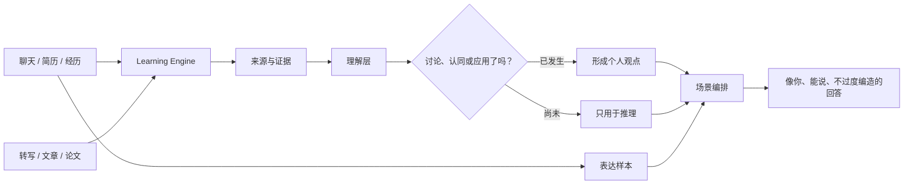

# MindClone

MindClone 不是把聊天记录扔进黑箱，然后宣布“我已经懂你了”的机器人。

它更像一个长期相处的伙伴：记住事情来自哪里，先理解外部知识，再通过讨论、认同和实际应用逐渐形成你的理解。它可以把话说得更清楚、更专业，但不能把别人的经历顺手改成你的经历。

面试是第一场验收。每次面试都会冻结本次 JD、简历、听众和目标；简历可以在当前场景中优先，但不会反向改写长期身份。



当前短视频学习只处理转写后的语音文字，不分析视频画面。MindClone 使用 TiKHub 获取临时媒体、本地 Whisper 转写，随后删除临时文件。

从仓库根目录启动：

```bash
npm run dev -- mind-clone
```

或者：

```bash
cd apps/mind-clone
npm run dev
```

打开 `http://127.0.0.1:5269/`。
